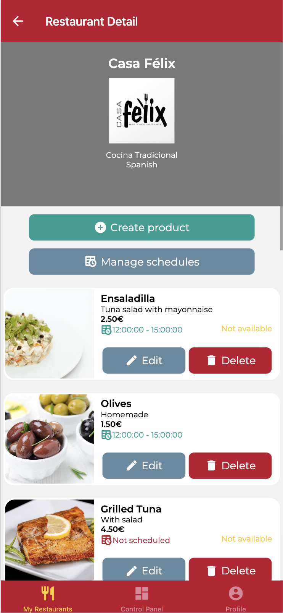
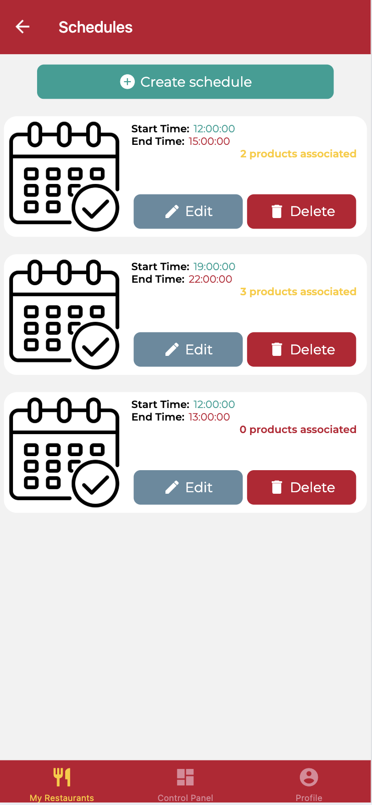
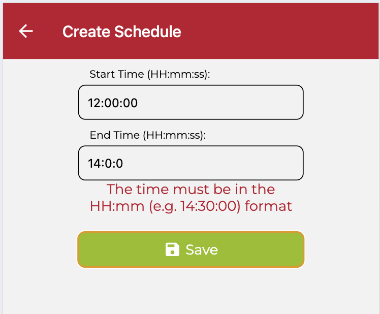
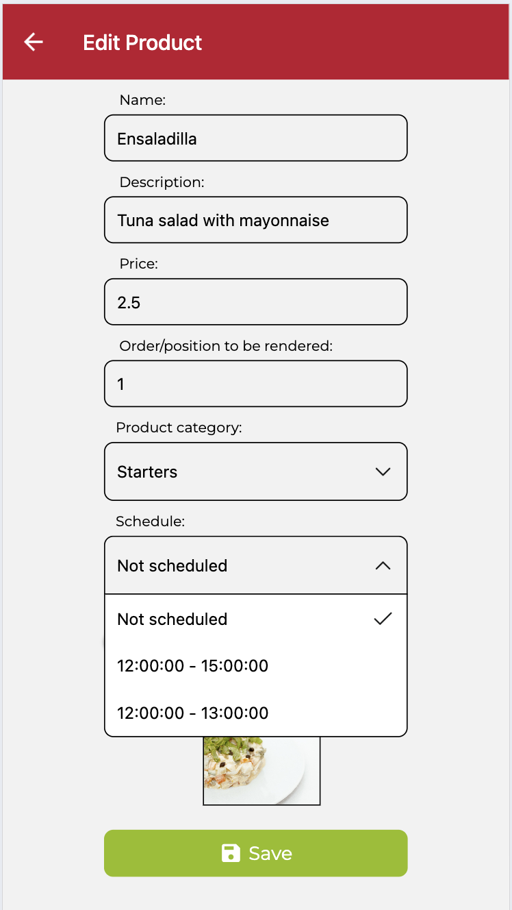

# Examen DeliverUS - Modelo B - Horarios de Productos (Schedules)

Recuerde que DeliverUS está descrito en: <https://github.com/IISSI2-IS-2025>

## Enunciado del examen

Se ha de implementar la interfaz gráfica de algunos requisitos funcionales de los propietarios, en concreto relacionados con la **gestión de horarios de los productos de los restaurantes**.

### ¿Qué son los horarios (Schedules)?

En DeliverUS, los horarios (Schedules) representan intervalos concretos de tiempo (con hora de inicio y hora de fin en formato HH:mm:ss) en los que ciertos productos de un restaurante están disponibles para pedidos. Esto permite definir claramente cuándo se pueden realizar pedidos de ciertos productos.

Los horarios son útiles, por ejemplo, para ofrecer menús específicos de desayuno, almuerzo o cena, y para establecer horas concretas en las que ciertos productos pueden estar disponibles.

Cada propietario de restaurante podrá definir los horarios para cada uno de sus restaurantes, y por lo tanto, cada producto se podrá asociar a uno de los horarios registrados para el restaurante al que pertenece. Se nos ha proporcionado el siguiente modelado conceptual:


Se le proporciona un backend con los endpoints siguientes ya implementados:

### Obtener el detalle de restaurante (incluye los productos con su horario)

- `GET /restaurants/:restaurantId`

Ejemplo de respuesta:

  ```Javascript
  {
    id: 1,
    name: "Casa Félix",
    // ... resto de propiedades de restaurante
    products: 
      [
        {
            id: 1,
            name: "Ensaladilla",
            // ... resto de propiedades de product
            schedule: {
                id: 2,
                startTime: "12:00:00",
                endTime: "15:00:00",
                restaurantId: 1,
                createdAt: "2025-05-14T08:48:12.000Z",
                updatedAt: "2025-05-14T08:48:12.000Z"
            }
        },
        {
            id: 2,
            name: "Olives",
            description: "Homemade",
            // ... resto de propiedades de product
            schedule: {
                id: 2,
                startTime: "12:00:00",
                endTime: "15:00:00",
                restaurantId: 1,
                createdAt: "2025-05-14T08:48:12.000Z",
                updatedAt: "2025-05-14T08:48:12.000Z"
            }
        }
        // ... otros productos del restaurante
      ]
}
  ```

### Obtener todos los horarios de un restaurante (cada horario incluye los productos ya asociados a él)

- `GET /restaurants/:restaurantId/schedules`

Ejemplo de respuesta:

  ```Javascript
 [
    {
        id: 1,
        startTime: "08:00:00",
        endTime: "11:00:00",
        restaurantId: 1,
        createdAt: "2025-05-14T08:48:12.000Z",
        updatedAt: "2025-05-14T08:48:12.000Z",
        products: [
            {
                id: 6,
                name: "Coffee",
                // ... resto de propiedades del producto
            },
            {
                id: 8,
                name: "Water",
                // ... resto de propiedades del producto
            }
            // ... resto de productos asociados al horario
        ]
    },
    {
        id: 2,
        startTime: "12:00:00",
        endTime: "15:00:00",
        restaurantId: 1,
        createdAt: "2025-05-14T08:48:12.000Z",
        updatedAt: "2025-05-14T08:48:12.000Z",
        products: [
            {
                id: 1,
                name: "Ensaladilla",
                // ... resto de propiedades del producto
            },
            {
                id: 2,
                name: "Olives",
                // ... resto de propiedades del producto
            }
            // ... resto de productos asociados al horario
        ]
    }
    // ... resto de horarios del restaurante
 ]
  ```

### Actualizar un horario existente

- `PUT /restaurants/:restaurantId/schedules/:scheduleId`

Recibe un objeto json en el cuerpo de la petición con la forma del siguiente ejemplo:

  ```Javascript
  {
      startTime: '08:00:00',
      stopTime: '12:00:00'
  }
  ```

### Eliminar un horario existente

- `DELETE /restaurants/:restaurantId/schedules/:scheduleId`

### Actualizar un producto (asignar o desasignar horario)

- `PUT /products/:productId`

Recibe un objeto json en el cuerpo de la petición con la forma del siguiente ejemplo:

```Javascript
{
  name: "Ensaladilla",
  description: "Tuna salad with mayonnaise",
  price: 2.5,
  order: 1,
  productCategoryId: 1,
  availability: true,
  scheduleId: 2 // null para desasignar
}
```

Es necesaria la implementación de la parte de frontend de los siguientes requisitos funcionales:

### RF.01 – Visualización de productos con sus horarios asignados

**Como**  
propietario,

**Quiero**  
ver un listado con todos los productos de uno de mis restaurantes, incluyendo el horario que tengan asignado (si lo hubiera),

**Para**  
conocer fácilmente su disponibilidad en función del horario.

#### Pruebas de aceptación

- El listado de productos se muestra en `RestaurantDetailScreen.js`.
- Para cada producto se muestra la hora de inicio y de fin del horario asignado.
- Si un producto no tiene horario asignado, debe mostrarse "Not scheduled".

---

### RF.02 – Visualización de horarios del restaurante y número de productos asociados

**Como**  
propietario,

**Quiero**  
ver un listado de todos los horarios definidos para un restaurante, junto con el número de productos que están asignados a cada horario,

**Para**  
gestionar mejor las franjas horarias en función del uso real que tienen.

#### Pruebas de aceptación

- La pantalla `RestaurantSchedulesScreen.js` muestra los horarios del restaurante con:
  - Hora de inicio
  - Hora de fin
  - Número de productos asociados
- Cada horario incluye un botón para editar y otro para eliminarlo.
- Existe un botón en `RestaurantDetailScreen.js` para acceder a esta pantalla.

### RF.03 – Borrado de horario de restaurante

**Como**  
propietario,

**Quiero**  
borrar los horarios de mis restaurantes,

**Para**  
ajustar los horarios disponibles asignables a los productos de mis restaurantes.

#### Pruebas de aceptación

- Se muestra un botón de eliminación en el listado de horarios `RestaurantSchedulesScreen.js` para cada horario.
- Si se desea eliminar un horario, se muestra una alerta de confirmación.
- Tras eliminar un horario, se navega a `RestaurantDetailScreen.js` con el listado de productos actualizado.

---

### RF.04 – Creación de horario para restaurante (se le proporciona ya implementado)

**Como**  
propietario,

**Quiero**  
crear un nuevo horario indicando hora de inicio y fin,

**Para**  
establecer la disponibilidad de productos en mi restaurante.

#### Pruebas de aceptación

- El formulario está implementado en `CreateScheduleScreen.js`.
- Los campos son obligatorios y deben cumplir:
  - Hora de inicio y fin en formato `HH:mm:ss`.
- Si algún campo no cumple la validación, se muestra un mensaje de error adecuado.
- Al guardar correctamente, se redirige al listado de horarios y se muestra un mensaje de éxito.
- Tras la creación de un horario, se navega a `RestaurantDetailScreen.js`.

---

### RF.05 – Edición de un horario existente

**Como**  
propietario,

**Quiero**  
poder editar un horario previamente creado en el restaurante,

**Para**  
corregir errores o ajustar la disponibilidad.

#### Pruebas de aceptación

- El formulario está implementado en `EditScheduleScreen.js`.
- Los campos se precargan con los valores actuales del horario.
- Se validan los mismos criterios que en la creación.
- Si la validación falla, se muestra el error correspondiente.
- Tras editar un horario, se navega a `RestaurantDetailScreen.js` con el listado de productos actualizado.

---

### RF.06 – Asignación o desasignar de horario en productos

**Como**  
propietario,

**Quiero**  
asignar uno de los horarios existentes a un producto, o eliminar un horario ya asignado,

**Para**  
modificar la disponibilidad del producto en función de las necesidades.

#### Pruebas de aceptación

- La funcionalidad debe estar implementada en `EditProductScreen.js`.
- Se muestra una lista desplegable con los horarios disponibles del restaurante.
- Puede seleccionarse un horario existente o establecer que no haya horario asignado.
- Tras editar un producto, se navega a `RestaurantDetailScreen.js` con el listado de productos actualizado.

---

## Ejercicios

### 1. Listado de productos con horarios. 1,5 puntos

Trabaje el RF.01 en el fichero `./DeliverUS-Frontend-Owner/src/screens/restaurants/RestaurantDetailScreen.js` realizando todos los cambios necesarios para mostrar una interfaz como se muestra en la Figura 1.



Figura 1: listado de productos con horarios

Aspectos a tener en cuenta:

- Modificar la pantalla existente para incluir el horario asignado (si lo hay) de cada producto.
- Mostrar el horario en formato legible: Hora de inicio - Hora de fin.
- Si el producto no tiene horario, mostrar el mensaje "Not Scheduled".
- El nombre del `MaterialCommunityIcon` del icono junto al horario (y del botón del próximo ejercicios) es `timetable`

---

### 2. Gestión de horarios. 2,5 puntos

Implemente el RF.02 en el fichero `./DeliverUS-Frontend-Owner/src/screens/restaurants/RestaurantSchedulesScreen.js` realizando todos los cambios necesarios para mostrar una interfaz como se muestra en la Figura 2.



Figura 2: listado de horarios

Aspectos a tener en cuenta:

- Mostrar el listado de horarios con el número de productos asociados.
- Incorporar botones de edición y borrado para cada horario.
- El listado de horarios puede obtenerse a través de la función `getRestaurantSchedules (id)` que ya se le proporciona en `./DeliverUS-Frontend-Owner/src/api/RestaurantEndpoints.js` y que realiza la petición necesaria a backend.

---

### 3. Borrado de horarios. 1 punto

Implemente el RF.03 en el fichero `./DeliverUS-Frontend-Owner/src/screens/restaurants/RestaurantSchedulesScreen.js` realizando todos los cambios necesarios.

Aspectos a tener en cuenta:

- Use el componente `DeleteModal` para mostrar pedir confirmación de borrado.
- El borrado de horario puede completarse llamando a la función `removeSchedule (restaurantId, scheduleId)` que ya se le proporciona en `./DeliverUS-Frontend-Owner/src/api/RestaurantEndpoints.js` y que realiza la petición necesaria a backend.

---

### 4. Edición de horario. 2,5 puntos

Implemente el RF.05 en el fichero `./DeliverUS-Frontend-Owner/src/screens/restaurants/EditScheduleScreen.js` realizando todos los cambios necesarios para mostrar una interfaz  como se muestra en la Figura 3.



Figura 3: formulario de edición de horario

Aspectos a tener en cuenta:

- Precargar los valores actuales del horario.
- Debe incorporar lo necesario para habilitar la navegación desde la pantalla de gestión de horarios.
- La edición de horario puede realizarse llamando a la función `updateSchedule (restaurantId, scheduleId, data)` que ya se le proporciona en `./DeliverUS-Frontend-Owner/src/api/RestaurantEndpoints.js` y que realiza la petición necesaria a backend.

---

### 5. Asignar o desasignar horario a producto. 2,5 punto

Implemente el RF.06 en el fichero `./DeliverUS-Frontend-Owner/src/screens/restaurants/EditProductScreen.js` realizando todos los cambios necesarios para mostrar una interfaz como se muestra en la Figura 4.



Figura 4: formulario de edición de producto incorporando asignación de horario

---

## Procedimiento de entrega

1. Borrar las carpetas **DeliverUS-Backend/node_modules**, **DeliverUS-Frontend-Owner/node_modules** y **DeliverUS-Frontend-Owner/.expo**.
1. Crear un ZIP que incluya todo el proyecto. **Importante: Comprueba que el ZIP no es el mismo que te has descargado e incluye tu solución**
1. Avisa al profesor antes de entregar.
1. Cuando el profesor te dé el visto bueno, puedes subir el ZIP a la plataforma de Enseñanza Virtual. **Es muy importante esperar a que la plataforma te muestre un enlace al ZIP antes de pulsar el botón de enviar**. Se recomienda descargar ese ZIP para comprobar lo que se ha subido. Un vez realizada la comprobación, puedes enviar el examen.

## Preparación del Entorno

### a) Windows

- Abre una terminal y ejecuta el siguiente comando:

    ```bash
    npm run install:all:win
    ```

### b) Linux/MacOS

- Abre una terminal y ejecuta el siguiente comando:

    ```bash
    npm run install:all:bash
    ```

## Ejecución

### Backend

- Para **recrear las migraciones y seeders**, abre una terminal y ejecuta el siguiente comando:

    ```bash
    npm run migrate:backend
    ```

- Para **iniciar el backend**, abre una terminal y ejecuta el siguiente comando:

    ```bash
    npm run start:backend
    ```

### Frontend

- Para **ejecutar la aplicación frontend del `owner`**, abre una nueva terminal y ejecuta el siguiente comando:

    ```bash
    npm run start:frontend
    ```

## Depuración

- Para **depurar el frontend**, asegúrate de que **SÍ** haya una instancia en ejecución del frontend que deseas depurar, y usa las herramientas de depuración del navegador.
# ExLab-Frontend-Curso-Schedules-master

